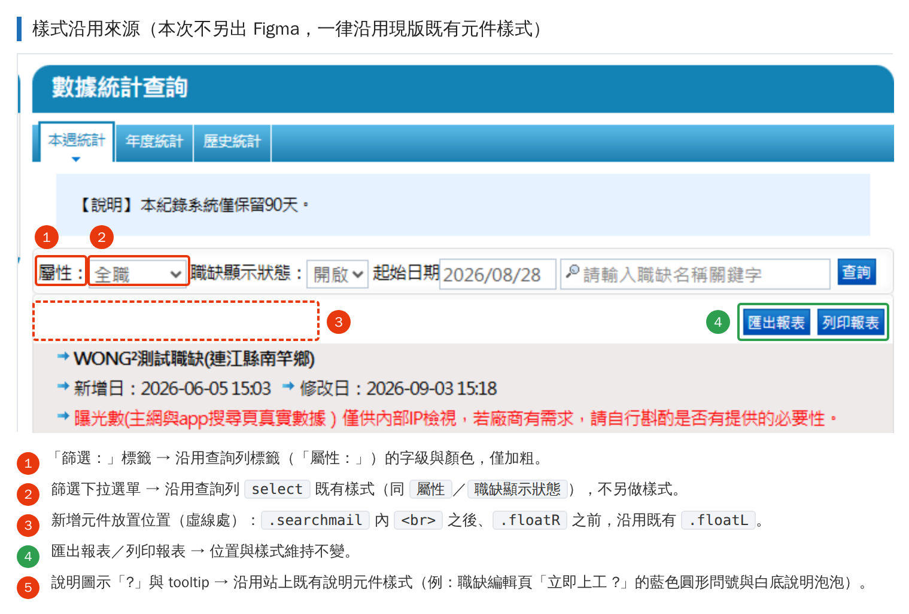
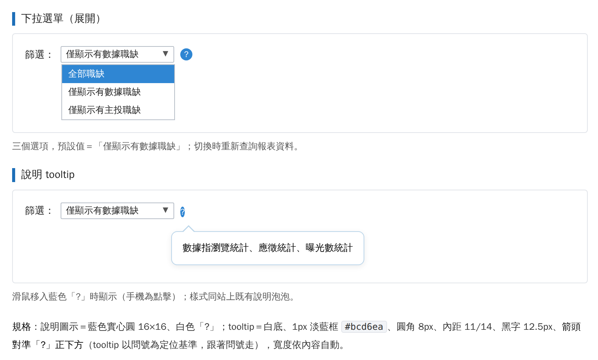

# 數據統計查詢：新增「職缺篩選」下拉選單與說明 tooltip

**頁面**：企業會員後台 › 數據統計查詢
**適用範圍**：以下三個分頁皆需一致
[本週統計](https://recruit.1111.com.tw/LogCalculateWeek.aspx)　
[年度統計](https://recruit.1111.com.tw/LogCalculateYear.aspx)　
[歷史統計](https://recruit.1111.com.tw/LogCalculateHistory.aspx)
**對應任務卡**：數據統計查詢－新增數據分類篩選

---

## 一、需求說明

因客服反映：現行數據統計需先下載全部職缺報表，再用 Excel 篩選才能辨識哪些職缺有履歷數據，第一線人員無法即時判讀，操作相對不便。故於 `匯出報表`／`列印報表` 那一列的左側，新增 `篩選：` 下拉選單與說明圖示，讓使用者直接切換要顯示的職缺範圍。

---

## 二、設計說明

- 請用 html 的 element style，對應語法見需求下方。
- 本次調整**全數沿用現版既有樣式**，未新增視覺元件，**故無 Figma 檔**；各元件樣式取樣位置已於示意圖圈出：
    - ① `篩選：` 標籤 → 沿用查詢列標籤 `屬性：` 的字級與顏色，僅加粗
    - ② 下拉選單 → 沿用查詢列既有 `select`（同 `屬性`／`職缺顯示狀態`）
    - ③ 新增元件位置 → `.searchmail` 內 `<br>` 之後、`.floatR` 之前，沿用既有 `.floatL`
    - ④ `匯出報表`／`列印報表` → 位置與樣式維持不變
    - ⑤ 說明圖示 `?` 與 tooltip → 沿用站上既有說明元件樣式（例：職缺編輯頁 `立即上工 ?`）
- **請按照示意圖切版 html 標籤**，沿用現有結構與命名慣例，不需另建一套版型。
- 下方示意語法僅供參考，**主要以切版成果為主**；class 命名與樣式歸屬可依前端既有規範調整，視覺與行為符合本工單即可。



---

## 三、需求內容

### 1. 新增 `篩選：` 下拉選單

- 位置：`匯出報表`／`列印報表` 同一列的左側，左緣對齊上一列 `屬性：`
- 選項與預設值：

    | 顯示文字 | value | 說明 |
    | --- | --- | --- |
    | 全部職缺 | `all` | 不篩選 |
    | 僅顯示有數據職缺 | `hasData` | **預設值** |
    | 僅顯示有主投職缺 | `mainApply` | |

- 邏輯需求：切換選項時，以目前查詢條件重新查詢並重繪報表（沿用既有查詢／AJAX）；按 `查詢` 後篩選值需保留。
- 「有數據」定義：`瀏覽統計`、`應徵統計`、`曝光數統計` 任一項不為 0。（如與現行定義不同請回覆確認）

### 2. 新增說明圖示 `?` 與 tooltip

- 圖示：藍色圓形 `?`，置於下拉選單右側
- 觸發：滑鼠移入顯示、移出隱藏；手機／平板為點擊切換，點其他區域關閉
- 顯示文字：`數據指瀏覽統計、應徵統計、曝光數統計`
- 樣式：白底、淡藍色細框、圓角、黑字，上方帶小箭頭
- 位置：以 `?` 為定位基準顯示於其正下方，箭頭對準 `?` 中心，`?` 位置變動時 tooltip 需跟著移動




---

## 四、對應語法（示意，實際以切版成果為主）

### 插入位置

```html
<div class="searchmail ">
  <div class="floatL"> …屬性…職缺顯示狀態…起始日期…關鍵字…查詢… </div>
  <br>
  <!-- ★ 新增的篩選區塊放這裡（沿用 .floatL） -->
  <div class="floatR"> 匯出報表／列印報表 </div>
  <div class="clear"></div>
</div>
```

### HTML

```html
<div class="floatL jobFilter">
  <b>篩選：</b>
  <select id="selJobFilter" name="selJobFilter">
    <option value="all">全部職缺</option>
    <option value="hasData" selected>僅顯示有數據職缺</option>
    <option value="mainApply">僅顯示有主投職缺</option>
  </select>
  <span class="jfTip">
    <i class="jfIcon" id="jfIcon" tabindex="0" role="button" aria-label="篩選說明"
       aria-describedby="jfTipBox">?</i>
    <span class="jfTipBox" id="jfTipBox" role="tooltip">數據指瀏覽統計、應徵統計、曝光數統計</span>
  </span>
</div>
```

### CSS

```css
.jobFilter{clear:left;line-height:40px;}
.jobFilter b{font-weight:bold;}
.jobFilter select{vertical-align:middle;}

.jobFilter .jfTip{position:relative;display:inline-block;vertical-align:middle;line-height:normal;}
.jobFilter .jfIcon{display:inline-block;width:16px;height:16px;margin-left:6px;border-radius:50%;
  background:#2f86d3;color:#fff;font-size:11px;line-height:16px;font-style:normal;font-weight:bold;
  text-align:center;cursor:pointer;user-select:none;vertical-align:middle;}
.jobFilter .jfIcon:focus{outline:none;box-shadow:0 0 0 2px rgba(47,134,211,.35);}

.jobFilter .jfTipBox{position:absolute;top:26px;left:-4px;z-index:999;display:none;white-space:nowrap;
  padding:11px 14px;border:1px solid #bcd6ea;border-radius:8px;background:#fff;
  box-shadow:0 2px 8px rgba(0,0,0,.08);color:#000;font-size:12.5px;line-height:1.7;text-align:left;}
.jobFilter .jfTipBox::before,
.jobFilter .jfTipBox::after{content:"";position:absolute;left:14px;border:8px solid transparent;}
.jobFilter .jfTipBox::before{top:-17px;border-bottom-color:#bcd6ea;}
.jobFilter .jfTipBox::after{top:-15px;border-bottom-color:#fff;}
.jobFilter .jfTip:hover .jfTipBox,
.jobFilter .jfIcon:focus + .jfTipBox,
.jobFilter .jfTipBox.is-show{display:block;}

@media print{ .jobFilter{display:none;} }
```

### JS

```javascript
(function () {
  var ic = document.getElementById('jfIcon'), box = document.getElementById('jfTipBox');
  if (ic && box) {
    ic.addEventListener('click', function (e) {
      e.stopPropagation();
      box.className = (box.className.indexOf('is-show') > -1) ? 'jfTipBox' : 'jfTipBox is-show';
    });
    document.addEventListener('click', function () { box.className = 'jfTipBox'; });
    ic.addEventListener('keydown', function (e) {
      if (e.keyCode === 27) { box.className = 'jfTipBox'; ic.blur(); }
    });
  }
  var sel = document.getElementById('selJobFilter');
  if (sel) {
    sel.addEventListener('change', function () {
      // TODO: 帶入 this.value（all / hasData / mainApply）後重新查詢報表
    });
  }
})();
```

---

## 五、不得更動

- `匯出報表`／`列印報表`：位置、樣式、既有功能全部維持原狀。
- `.searchmail` 為 `width:710px`、`height:43px`、背景圖 `se_bg2.gif`，**請勿更動其 `height` 與 `background`**，否則查詢列灰底框線會消失。
- 新增元件不可與職缺標題／新增日／曝光數說明等文字重疊。

---

## 六、驗收條件

1. 上述三個分頁都看得到篩選列，預設值為 `僅顯示有數據職缺`。
2. 切換三個選項，報表資料正確變動；重新查詢後篩選值保留。
3. `篩選：` 左緣與上一列 `屬性：` 左緣切齊；按鈕位置與改版前一致。
4. 滑鼠移入 `?` 顯示指定文字，樣式與位置符合規格；手機點擊可顯示與關閉。
5. 列印報表輸出內容不含篩選列。
6. 查詢列灰底框線與高度與改版前一致（無破版）。

---

## 七、附件

- `job-filter-style-source.png`　樣式沿用來源（圈選現版對應元件）
- `job-filter-overlay.png`　　　修改後版面示意
- `job-filter-menu-tooltip.png`　下拉選單展開與 tooltip 樣式
- `職缺篩選_版面示意.pdf`　　　上述三張合併檔
